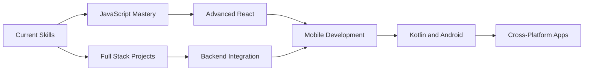

# Mirko Joel Ruhl

  

 

## About Me

I am a Full Stack Developer focused on building polished, practical products that blend clean engineering with strong UI/UX decisions. I enjoy turning ideas into interactive experiences across web, desktop, and mobile.

## What I Build

- Web applications with modern frontend architecture and responsive interfaces.
- Backend services and APIs with Node.js and Express.
- Desktop and automation tools with Python.
- Mobile apps with Kotlin and Android Studio.
- Interactive experiences with Godot.

## Tech Stack

### Frontend

  
  
  
  
  
  
  

### Backend and Tools

  
  
  
  
  
  

### Mobile and Game Dev

  
  
  

## GitHub Stats

  
  

  

## Featured Projects

| Project                                                                | Description                                                    | Stack                 |
| ---------------------------------------------------------------------- | -------------------------------------------------------------- | --------------------- |
| 🎲 [Liar's Dice](https://github.com/RuhlMirko/js-lying-dice)           | Interactive dice game with strategic gameplay mechanics.       | JavaScript, HTML, CSS |
| 🃏 [Blackjack Game](https://github.com/RuhlMirko/javascript-blackjack) | Classic card game with smooth animations and game logic.       | JavaScript, HTML, CSS |
| ⏰ [Pomodoro Timer](https://github.com/RuhlMirko/pomodoro-timer)       | Productivity timer with customizable work and break intervals. | JavaScript, HTML, CSS |
| 🖼️ [Web Wallpapers](https://github.com/RuhlMirko/wallpaper-engine)     | Dynamic wallpaper collection with interactive effects.         | HTML, CSS, JavaScript |

## 2026 Goals

- Deepen JavaScript expertise with larger, production-like apps.
- Build more complete full stack projects from idea to deployment.
- Continue leveling up Android development with Kotlin.
- Expand portfolio with creative and technically diverse builds.
- Contribute to open source and collaborate more consistently.

## Connect

Looking for web development services or collaboration opportunities.

---

  

